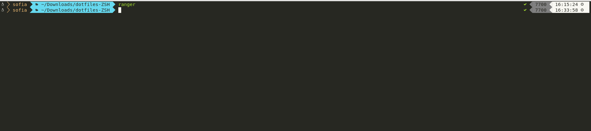
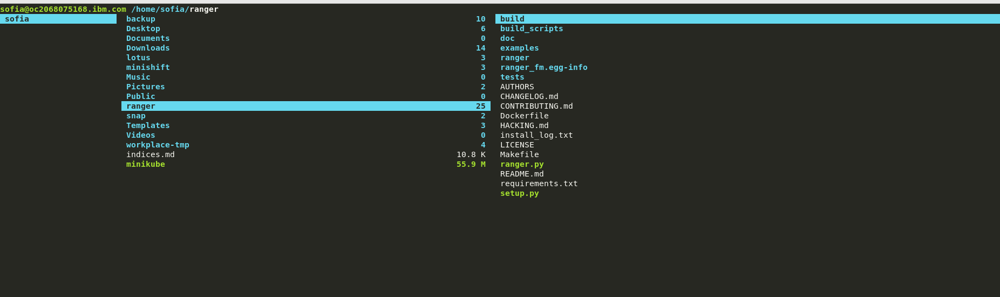

https://terminalsare.sexy/

This repository is a list of terminals that I use in my lifestyle. A list of these are the following:

# ZSH akaa [Oh my ZSH](https://ohmyz.sh/)


Oh My Zsh is an open source, community-driven framework for managing your [zsh](http://www.zsh.org/) configuration. 


## Getting Started


### Basic Installation

Oh My Zsh is installed by running one of the following commands in your terminal. You can install this via the command-line with either `curl` or `wget`.

#### via curl

`curl -L https://raw.github.com/robbyrussell/oh-my-zsh/master/tools/install.sh | sh`

#### via wget

`wget https://raw.github.com/robbyrussell/oh-my-zsh/master/tools/install.sh -O - | sh`

## Using Oh My Zsh

### Plugins

Oh My Zsh comes with a shit load of plugins to take advantage of. You can take a look in the [plugins](https://github.com/robbyrussell/oh-my-zsh/tree/master/plugins) directory and/or the [wiki](https://github.com/robbyrussell/oh-my-zsh/wiki/Plugins) to see what's currently available.

#### Enabling Plugins

If you spot a plugin (or several) that you would like to use with Oh My Zsh, you will need to edit the `~/.zshrc` file. Once you open it with your favorite editor, you'll see a spot to list all the plugins that you'd like Oh My Zsh to load in initialization.

For example, this line might begin to look like...

`plugins=(git bundler osx rake ruby)`

#### Using Plugins

Most plugins (should! we're working on this) include a __README__, which documents how to use them.

### [Themes](https://wiki.github.com/robbyrussell/oh-my-zsh/themes) 

#### Selecting a Theme

_Robby's theme is the default one. It's not the fanciest one. It's not the simplest one. It's just right (for him)._

Once you find a theme that you want to use, you will need to edit the `~/.zshrc` file. An example is included [here](./dotfiles/.zshrc) You'll see an environment variable (all caps) in there that looks like:

`ZSH_THEME="robbyrussell"`

To use a different theme, simple change the value to match the name of your desired theme. For example:

`ZSH_THEME="agnoster"` (this is one of the fancy ones)

Open up a new terminal window and your prompt should look something like...


## Advanced Topics

If you're the type that likes to get their hands dirty... these sections might resonate.

### Advanced Installation

For those who want to install this manually and/or set custom paths.

#### Custom Directory

The default location is `~/.oh-my-zsh` (hidden in your home directory)

If you'd like to change the install directory with the `ZSH` environment variable, either by running `export ZSH=/your/path` before installing, or by setting it before the end of the install pipeline like this:

`curl -L https://raw.github.com/robbyrussell/oh-my-zsh/master/tools/install.sh | ZSH=~/.dotfiles/zsh sh`

#### Manual Installation

##### 1. Clone the repository:

`git clone git://github.com/robbyrussell/oh-my-zsh.git ~/.oh-my-zsh`

##### 2. *Optionally*, backup your existing @~/.zshrc@ file:

`cp ~/.zshrc ~/.zshrc.orig`

##### 3. Create a new zsh configuration file

You can create a new zsh config file by copying the template that we included for you.

`cp ~/.oh-my-zsh/templates/zshrc.zsh-template ~/.zshrc`

##### 4. Change your default shell

`chsh -s /bin/zsh`

##### 5. Initialize your new zsh configuration

Once you open up a new terminal window, it should load zsh with Oh My Zsh's configuration.

### Installation Problems

If you have any hiccups installing, here are a few common fixes.

* You _might_ need to modify your `PATH` in `~/.zshrc` if you're not able to find some commands after switching to `oh-my-zsh`.
* If you installed manually or changed the install location, check the `ZSH` environment variable in `~/.zshrc`.

### Custom Plugins and Themes

If you want to override any of the default behaviors, just add a new file (ending in `.zsh`) in the `custom/` directory.

If you have many functions that go well together, you can put them as a `abcyzeae.plugin.zsh` file in the `custom/plugins/` directory and then enable this plugin.

If you would like to override the functionality of a plugin distributed with Oh My Zsh, create a plugin of the same name in the `custom/plugins/` directory and it will be loaded instead of the one in `plugins/`.

## Getting Updates

By default, you will be prompted to check for upgrades every few weeks. If you would like `oh-my-zsh` to automatically upgrade itself without prompting you, set the following in your `~/.zshrc`:

`DISABLE_UPDATE_PROMPT=true`

To disable automatic upgrades, set the following in your `~/.zshrc`:

`DISABLE_AUTO_UPDATE=true`

### Manual Updates

If you'd like to upgrade at any point in time (maybe someone just released a new plugin and you don't want to wait a week?)... you just need to run:

`upgrade_oh_my_zsh`

Magic!

## Uninstalling Oh My Zsh

Oh My Zsh isn't for everyone. We'll miss you, but we want to make this an easy breakup.

If you want to uninstall `oh-my-zsh`, just run `uninstall_oh_my_zsh` from the command-line. It will remove itself and revert your previous `bash` or `zsh` configuration.


# RANGER


Ranger is a command line-based file manager with VI key bindings. It provides a minimalistic and nice curses interface with a view on the directory hierarchy. In this tutorial, we'll walk through the process of installing and configuring Ranger on Debian, Ubuntu and CentOS.

## Installing Ranger
Before installing Ranger, you must first install `make`, `git` and `vim`. The former two will be needed for installation, and vim is necessary for Ranger to open as a text editor.

> CentOS/Fedora/RHEL:
```
sudo yum update -y
sudo yum install make git vim -y
```
> Ubuntu/Debian:
```
sudo apt-get update -y
sudo apt-get install make git vim -y
```
___
<p>To install Ranger manually, you will need to download the latest Ranger repository from <a href="https://github.com/ranger/ranger">Github</a>:</p>

```
git clone https://github.com/hut/ranger.git
```
<p>Build and install Ranger:</p>

```
cd ranger
sudo make install
```
___
## Configuring Ranger

Run Ranger for a moment:
```
ranger
```

Exit with <kbd>SHIFT</kbd> + <kbd>Q</kbd>. This will allow Ranger to create its default configuration directory in `~/.config/ranger`

Now copy the generated configuration files with the following command:
```
ranger --copy-config=all
```
The output will look something like this:
```
creating: /home/user1/.config/ranger/apps.py
creating: /home/user1/.config/ranger/commands.py
creating: /home/user1/.config/ranger/rc.conf
creating: /home/user1/.config/ranger/options.py
creating: /home/user1/.config/ranger/scope.sh
```
Start Ranger:
```
ranger
```
After starting it, the first thing you will notice is a window layout, the left column shows the parent directory, the middle column the content and selection of the current directory and the right column child directories and files or a preview of the currently selected file.


